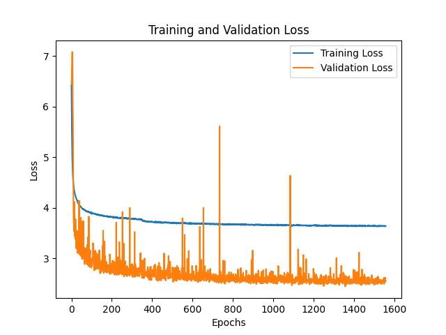
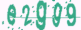
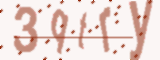
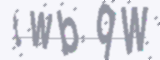
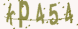

# CAPTCHA Solver
A machine learning model designed to solve CAPTCHAs. This project uses Convolutional Neural Networks (CNNs) and Global Attention to recognize and decode CAPTCHAs with high accuracy (>97%).

## Features
- CAPTCHA Recognition: Accurately predicts characters from CAPTCHA images.
- Data Augmentation: Uses techniques like rotation, translation, and contrast adjustments to enhance model robustness.
- Early Stopping: Monitors validation loss to prevent overfitting.
- Data Visualization: Saves the training and validation loss in a plot after finishing training.

## Model
| Layer (type)                   | Output Shape         | Param #   |
| ------------------------------ | -------------------- | --------- |
| `random_rotation (RandomRotation)` | `(None, 60, 160, 1)` | 0         |
| `random_translation (RandomTranslation)` | `(None, 60, 160, 1)` | 0         |
| `random_contrast (RandomContrast)` | `(None, 60, 160, 1)` | 0         |
| `conv2d (Conv2D)`              | `(None, 60, 160, 32)` | 320       |
| `batch_normalization (BatchNormalization)` | `(None, 60, 160, 32)` | 128       |
| `max_pooling2d (MaxPooling2D)` | `(None, 30, 80, 32)` | 0         |
| `dropout (Dropout)`            | `(None, 30, 80, 32)` | 0         |
| `conv2d_1 (Conv2D)`            | `(None, 30, 80, 64)` | 18,496    |
| `batch_normalization_1 (BatchNormalization)` | `(None, 30, 80, 64)` | 256       |
| `max_pooling2d_1 (MaxPooling2D)` | `(None, 15, 40, 64)` | 0         |
| `dropout_1 (Dropout)`          | `(None, 15, 40, 64)` | 0         |
| `global_attention (GlobalAttention)` | `(None, 15, 40, 64)` | 68        |
| `batch_normalization_3 (BatchNormalization)` | `(None, 15, 40, 64)` | 256       |
| `dropout_2 (Dropout)`          | `(None, 15, 40, 64)` | 0         |
| `flatten (Flatten)`            | `(None, 38400)`      | 0         |
| `dense (Dense)`                | `(None, 64)`         | 2,457,664 |
| `batch_normalization_4 (BatchNormalization)` | `(None, 64)`         | 256       |
| `dropout_3 (Dropout)`          | `(None, 64)`         | 0         |
| `dense_1 (Dense)`              | `(None, 175)`        | 11,375    |

**Total params:** 2,488,819 (9.49 MB)  
**Trainable params:** 2,488,369 (9.49 MB)  
**Non-trainable params:** 450 (1.76 KB)

## Usage
1. #### Generate CAPTCHAs and annotations
    Use ```captcha_generator.py``` to generate CAPTCHA images, labels and a JSON file containing image paths and corresponding labels.

2. #### Train the model
    Use ```model.py``` to
    - train the model on the generated CAPTCHAs
    - save the model
    - visualize training progress in a plot

3. #### Evaluate the model
    Use ```predict.py``` to solve any CAPTCHAs generated by ```captcha_generator.py```.

## Training loss plot


## Example evaluations
I generated 10 random CAPTCHAs and the model got all of them right in this case. You can find them in the ```examples``` folder, but here are some of them.

|  |  |  |  |
| :--: | :--: | :--: | :--: |
| Solution: e2gg9 | Solution: 3qtry | Solution: twbqw | Solution: kp454 |

We can observe that the model is capable of solving quite challenging CAPTCHAs.

## License
This project is licensed under the Apache-2.0 License - see the [LICENSE](../../blob/main/LICENSE) file for details.

## Acknowledgments
- <a href="https://pypi.org/project/captcha/" target="_blank">CAPTCHA Library</a> for CAPTCHA generation
- <a href="https://www.tensorflow.org/" target="_blank">Tensorflow</a> and <a href="https://keras.io/" target="_blank">Keras</a> for deep learning frameworks
