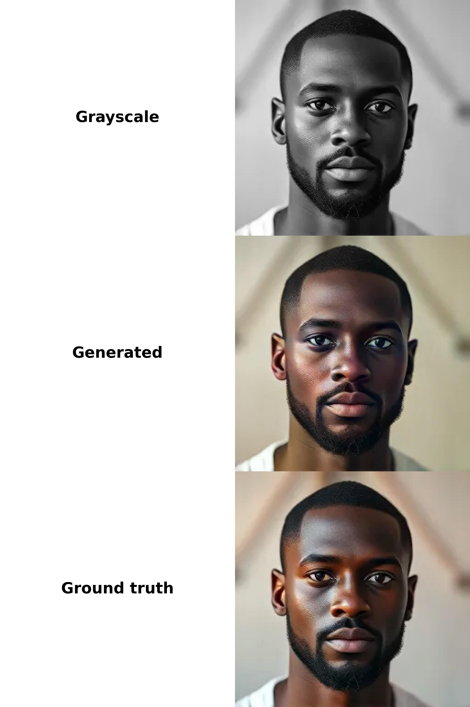

# Portrait colorization (try the [huggingface space for this project](https://huggingface.co/spaces/LennyS17/portrait-colorizer))
A deep learning model designed to colorize a given grayscale portrait. The architecture was adapted from [Pix2Pix](https://arxiv.org/pdf/1611.07004), featuring a U-Net Generator and a PatchGAN Discriminator.

The model was pretrained on 100k images for 20 epochs using L1 + adversarial loss and then improved on over 500k images for 5 epochs, only using the adversarial loss.

As explained in the original paper, the best approach is to utilize the La\*b\* color space so the generator only has to hallucinate 2 color channels instead of 3 when using RGB. Also, this perfectly preserves the "black and white structure", since the L channel is not altered at all.



The original image was generated with Flux.1-schnell (see [Acknowledgements](#acknowledgements)).


## Content
- [Model Architecture](#model-architecture)
    - [Generator](#generator)
    - [Discriminator](#discriminator)
- [Datasets](#datasets)
- [Usage](#usage)
- [Results](#results)

## Model Architecture
### Generator
| Layer (type)               | Output Shape               | Param #    |
|----------------------------|----------------------------|------------|
| input_1 (InputLayer)       | (None, 256, 256, 1)       | 0          |
| sequential                 | (None, 128, 128, 64)      | 1,024       |
| sequential_1               | (None, 64, 64, 128)       | 131,584     |
| sequential_2               | (None, 32, 32, 256)       | 525,312     |
| sequential_3               | (None, 16, 16, 512)       | 2,099,200    |
| sequential_4               | (None, 8, 8, 512)         | 4,,352    |
| sequential_5               | (None, 4, 4, 512)         | 4,196,352    |
| sequential_6               | (None, 2, 2, 512)         | 4,196,352    |
| sequential_7               | (None, 1, 1, 512)         | 4,196,352    |
| sequential_8               | (None, 2, 2, 512)         | 4,196,352    |
| concatenate                | (None, 2, 2, 1024)        | 0          |
| sequential_9               | (None, 4, 4, 512)         | 8,390,656    |
| concatenate_1              | (None, 4, 4, 1024)        | 0          |
| sequential_10              | (None, 8, 8, 512)         | 8,390,656    |
| concatenate_2              | (None, 8, 8, 1024)        | 0          |
| sequential_11              | (None, 16, 16, 512)       | 8,390,656    |
| concatenate_3              | (None, 16, 16, 1024)      | 0          |
| sequential_12              | (None, 32, 32, 256)       | 4,195,328    |
| concatenate_4              | (None, 32, 32, 512)       | 0          |
| sequential_13              | (None, 64, 64, 128)       | 1,049,088    |
| concatenate_5              | (None, 64, 64, 256)       | 0          |
| sequential_14              | (None, 128, 128, 64)      | 262,400     |
| concatenate_6              | (None, 128, 128, 128)     | 0          |
| conv2d_transpose_7         | (None, 256, 256, 2)       | 4,098       |
| **Total params**           | **54,421,762**              |            |
| **Trainable params**       | **54,410,882**              |            |
| **Non-trainable params**   | **10,880**                 |            |


### Discriminator
| Layer (type)               | Output Shape               | Param #    |
|----------------------------|----------------------------|------------|
| input_image (InputLayer)   | (None, 256, 256, 1)       | 0          |
| target_image (InputLayer)  | (None, 256, 256, 2)       | 0          |
| concatenate_7              | (None, 256, 256, 3)       | 0          |
| sequential_15              | (None, 128, 128, 128)     | 6,144       |
| sequential_16              | (None, 64, 64, 256)       | 525,312     |
| sequential_17              | (None, 32, 32, 512)       | 2,099,200    |
| zero_padding2d             | (None, 34, 34, 512)       | 0          |
| conv2d_11                  | (None, 31, 31, 1024)      | 8,388,608    |
| batch_normalization_16     | (None, 31, 31, 1024)      | 4,096       |
| leaky_re_lu_11             | (None, 31, 31, 1024)      | 0          |
| zero_padding2d_1           | (None, 33, 33, 1024)      | 0          |
| conv2d_12                  | (None, 30, 30, 1)         | 16,385      |
| **Total params**           | **11,039,745**              |            |
| **Trainable params**       | **11,036,161**              |            |
| **Non-trainable params**   | **3,584**                  |            |

## Datasets
For pretraining the network I used
- [Flickr-Faces-HQ Dataset (FFHQ)](https://github.com/NVlabs/ffhq-dataset)
    - 70k images
    - 256 x 256
- [CelebA-HQ Resized](https://www.kaggle.com/datasets/badasstechie/celebahq-resized-256x256), which is a resized version of the [original CelebA-HQ](https://arxiv.org/pdf/1710.10196v3)
    - 30k images
    - 256 x 256 (downsized from the original 1024 x 1024)

To further improve the model, I then added
- [Synthetic Faces High Quality (SFHQ) part 1](https://www.kaggle.com/datasets/selfishgene/synthetic-faces-high-quality-sfhq-part-1)
    - 89,785 images
    - 1024 x 1024
- [Synthetic Faces High Quality (SFHQ) part 2
](https://www.kaggle.com/datasets/selfishgene/synthetic-faces-high-quality-sfhq-part-2)
    - 91,361 images
    - 1024 x 1024
- [Synthetic Faces High Quality (SFHQ) part 3
](https://www.kaggle.com/datasets/selfishgene/synthetic-faces-high-quality-sfhq-part-3)
    - 118,358 images
    - 1024 x 1024
- [Synthetic Faces High Quality (SFHQ) part 4
](https://www.kaggle.com/datasets/selfishgene/synthetic-faces-high-quality-sfhq-part-4)
    - 125,754 images
    - 1024 x 1024

which I all resized to 256 x 256. All this comes down to 525,258 images of size 256 x 256.

## Usage
1. #### Install dependencies
    Run ```pip install -r requirements.txt``` in your terminal to install the necessary python packages.

2. #### Download necessary datasets
    Download the datasets mentioned [here](#datasets) and structure them like this:
    ```
    project/
    |   ...
    |
    └─  dataset/
        └─  ffhq/
        └─  celeba/
        └─  sfhq_pt1/
        └─  sfhq_pt2/
        └─  sfhq_pt3/
        └─  sfhq_pt4/
    ```

2. #### Train the model
    Run ```main.py``` to train the model on all datasets, or optionally choose exactly which ones should be used for training. You can adjust the number of epochs, batch size, etc. in ```data.py```. The model is automatically saved after training and also saves checkpoints.

3. #### Colorize images
    Run ```generate.py``` to check the generator's quality. Modify the file as you like to colorize arbitrary images. By default, images from the ```examples``` folder are taken, resulting in a table of images being created that you will see in the following section.

## Results

As you can see, the generator does a very good job at colorizing images, given there are "infinite" possibilities for the colorization task.

In some cases, the results might not be completely satisfying, but in general the model is able to generate very good results that can be improved by straightforward post-processing techniques like changing the saturation and hue.

## License
This project is licensed under the Apache-2.0 License - see the [LICENSE](../LICENSE) file for details.

## Acknowledgements
- <a href="https://www.tensorflow.org/" target="_blank">Tensorflow</a> and <a href="https://keras.io/" target="_blank">Keras</a> for deep learning frameworks
- [Flux.1-schnell](https://huggingface.co/black-forest-labs/FLUX.1-schnell) for synthetic portraits (example evaluations)
