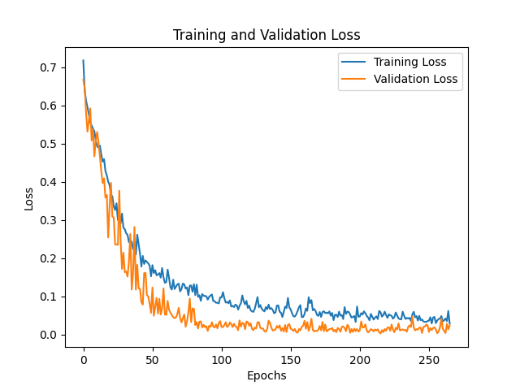
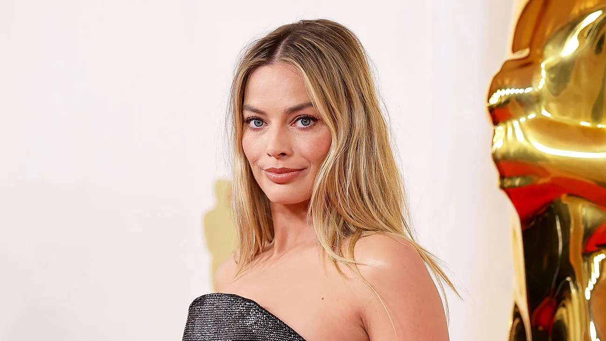
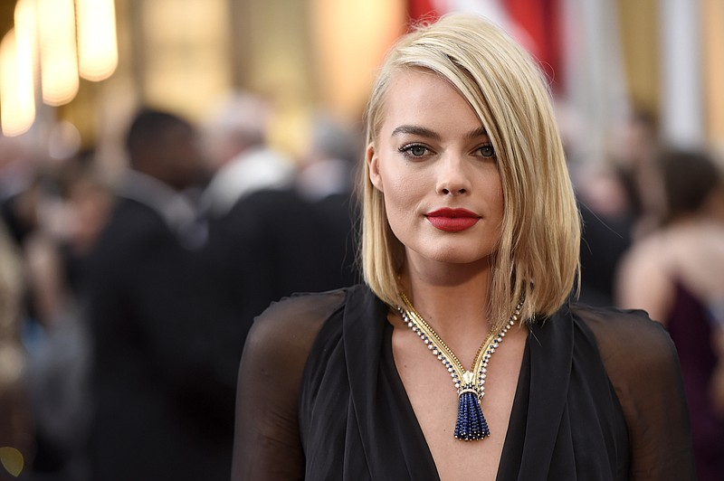
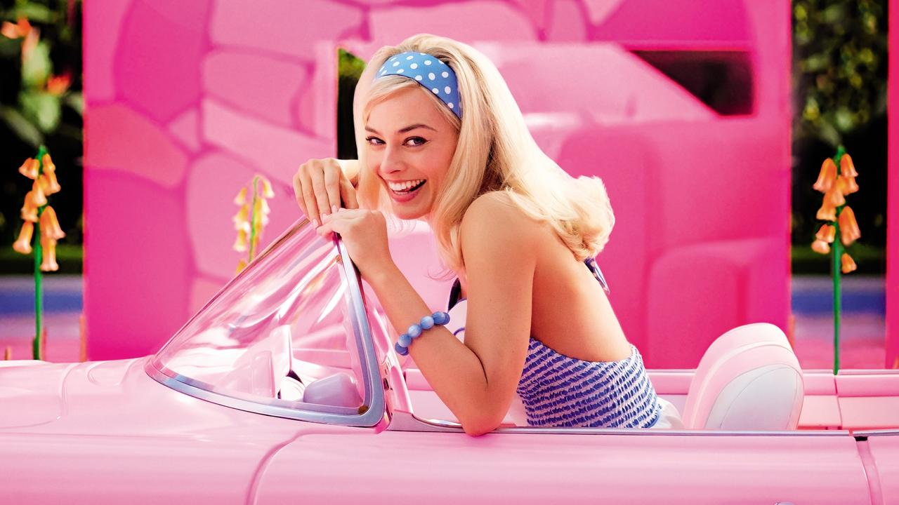
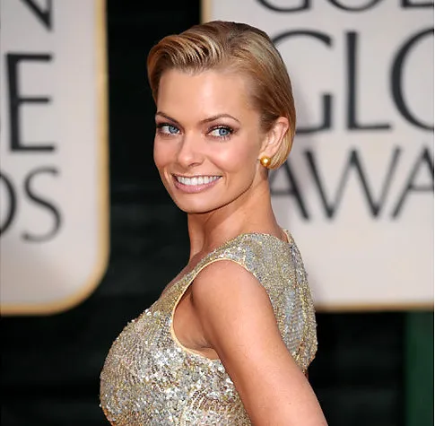
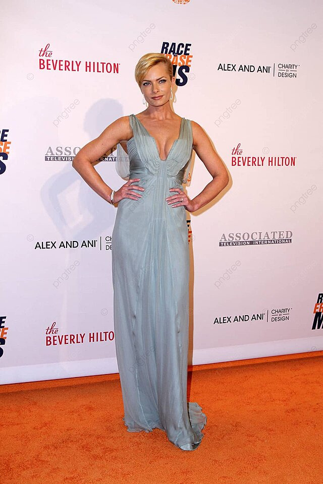
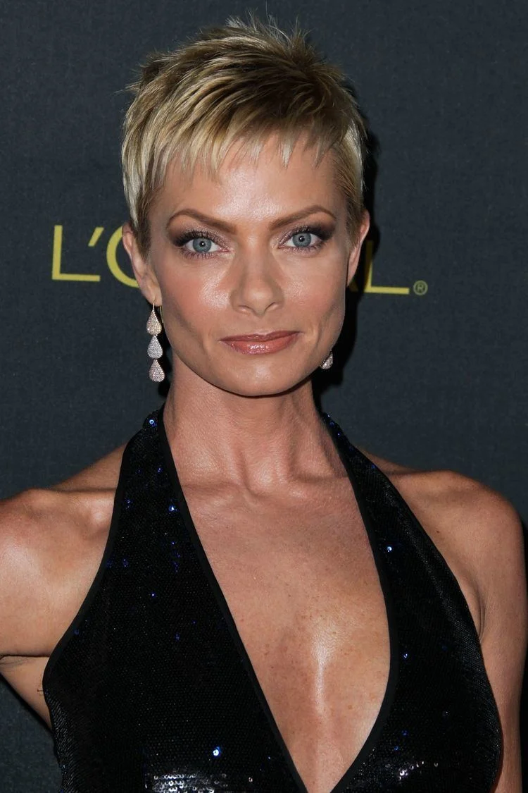

# Image classification
A machine learning model designed to distinguish Margot Robbie from Jaime Pressly in images. The model achieves acceptable results on unseen data. In the model's defense, the two look very similar.

## Features
- Solid classification of images of Margot Robbie or Jaime Pressly
- Data Augmentation: Uses techniques like rotation, translation, and contrast adjustments to enhance model robustness.
- Early Stopping: Monitors validation loss to prevent overfitting.
- Data Visualization: Saves the training and validation loss in a plot after finishing training.

## Model
| Layer (type)                         | Output Shape                | Param #         |
|--------------------------------------|-----------------------------|-----------------|
| random_flip (RandomFlip)             | (None, 355, 218, 1)         | 0               |
| random_rotation (RandomRotation)     | (None, 355, 218, 1)         | 0               |
| random_translation (RandomTranslation)| (None, 355, 218, 1)        | 0               |
| random_contrast (RandomContrast)     | (None, 355, 218, 1)         | 0               |
| conv2d (Conv2D)                      | (None, 353, 216, 32)        | 320             |
| activation (Activation)              | (None, 353, 216, 32)        | 0               |
| conv2d_1 (Conv2D)                    | (None, 351, 214, 64)        | 18,496          |
| activation_1 (Activation)            | (None, 351, 214, 64)        | 0               |
| max_pooling2d (MaxPooling2D)         | (None, 175, 107, 64)        | 0               |
| dropout (Dropout)                    | (None, 175, 107, 64)        | 0               |
| conv2d_2 (Conv2D)                    | (None, 173, 105, 64)        | 36,928          |
| activation_2 (Activation)            | (None, 173, 105, 64)        | 0               |
| max_pooling2d_1 (MaxPooling2D)       | (None, 86, 52, 64)          | 0               |
| dropout_1 (Dropout)                  | (None, 86, 52, 64)          | 0               |
| conv2d_3 (Conv2D)                    | (None, 84, 50, 128)         | 73,856          |
| activation_3 (Activation)            | (None, 84, 50, 128)         | 0               |
| max_pooling2d_2 (MaxPooling2D)       | (None, 42, 25, 128)         | 0               |
| dropout_2 (Dropout)                  | (None, 42, 25, 128)         | 0               |
| flatten (Flatten)                    | (None, 134,400)             | 0               |
| dense (Dense)                        | (None, 64)                  | 8,601,664       |
| dropout_3 (Dropout)                  | (None, 64)                  | 0               |
| dense_1 (Dense)                      | (None, 1)                   | 65              |
| **Total params**                     |                             | **26,193,989**  |
| **Trainable params**                 |                             | **8,731,329**   |
| **Non-trainable params**             |                             | **0**           |
| **Optimizer params**                 |                             | **17,462,660**  |


## Usage
1. #### Train the model
    Use ```main.py``` to
    - train the model on some images of the two
    - save the model
    - visualize training progress in a plot

2. #### Evaluate the model
    Use ```predict.py``` to find out whether the image features Margot Robbie or Jaime Pressly

## Training loss plot


## Example evaluations
I tested the model on 6 images which can be found in the ```testing``` folder.

|  |  |  |
| :--: | :--: | :--: |
| Output: Margot Robbie, 89.265% | Output: Margot Robbie, 59.478% | Output: Jaime Pressly, 97.792% |

|  |  |  |
| :--: | :--: | :--: |
| Output: Margot Robbie, 79.505% | Output: Jaime Pressly, 100% | Output: Jaime Pressly, 99.999% |

As I already said, the model isn't perfect.

## License
This project is licensed under the Apache-2.0 License - see the [LICENSE](../LICENSE) file for details.

## Acknowledgments
- <a href="https://www.tensorflow.org/" target="_blank">Tensorflow</a> and <a href="https://keras.io/" target="_blank">Keras</a> for deep learning frameworks