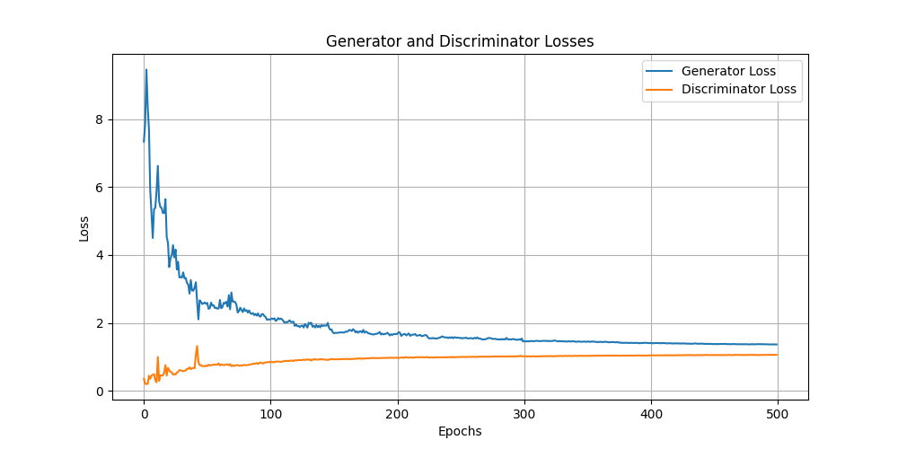

# Random handwritten digit generator
A machine learning model designed to generate random handwritten digits. This project uses a generative adversarial network (GAN).

## Features
- The generator can generate solid handwritten digits most of the time.
- Generate whole numbers with n digits and optional thousands spacing.

## Model
### Generator
| Layer (type)               | Output Shape          | Param #   |
|----------------------------|-----------------------|-----------|
| dense (Dense)               | (None, 50176)         | 5,017,600 |
| batch_normalization (Batch)  | (None, 50176)         | 200,704   |
| leaky_re_lu (LeakyReLU)     | (None, 50176)         | 0         |
| reshape (Reshape)           | (None, 7, 7, 1024)    | 0         |
| conv2d_transpose (Conv2DTranspose) | (None, 14, 14, 512) | 13,107,200 |
| batch_normalization_1 (BatchNormalization) | (None, 14, 14, 512) | 2,048     |
| leaky_re_lu_1 (LeakyReLU)   | (None, 14, 14, 512)   | 0         |
| conv2d_transpose_1 (Conv2DTranspose) | (None, 28, 28, 256) | 3,276,800 |
| batch_normalization_2 (BatchNormalization) | (None, 28, 28, 256) | 1,024     |
| leaky_re_lu_2 (LeakyReLU)   | (None, 28, 28, 256)   | 0         |
| conv2d_transpose_2 (Conv2DTranspose) | (None, 28, 28, 128) | 819,200   |
| batch_normalization_3 (BatchNormalization) | (None, 28, 28, 128) | 512       |
| leaky_re_lu_3 (LeakyReLU)   | (None, 28, 28, 128)   | 0         |
| conv2d_transpose_3 (Conv2DTranspose) | (None, 28, 28, 1)   | 3,200     |

**Total Params**: 22,428,288 (85.56 MB)  
**Trainable Params**: 22,326,144 (85.17 MB)    
**Non-trainable Params**: 102,144 (399.00 KB)

### Discriminator
| Layer (type)              | Output Shape        | Param #   |
|---------------------------|---------------------|-----------|
| conv2d (Conv2D)            | (None, 14, 14, 128) | 3328      |
| leaky_re_lu_4 (LeakyReLU)  | (None, 14, 14, 128) | 0         |
| dropout (Dropout)          | (None, 14, 14, 128) | 0         |
| conv2d_1 (Conv2D)          | (None, 7, 7, 256)   | 819456    |
| leaky_re_lu_5 (LeakyReLU)  | (None, 7, 7, 256)   | 0         |
| dropout_1 (Dropout)        | (None, 7, 7, 256)   | 0         |
| conv2d_2 (Conv2D)          | (None, 4, 4, 512)   | 3,277,312 |
| leaky_re_lu_6 (LeakyReLU)  | (None, 4, 4, 512)   | 0         |
| dropout_2 (Dropout)        | (None, 4, 4, 512)   | 0         |
| flatten (Flatten)          | (None, 8192)        | 0         |
| dense_1 (Dense)            | (None, 1)           | 8193      |

**Total Params**: 4,108,289 (15.67 MB)  
**Trainable Params**: 4,108,289 (15.67 MB)  
**Non-trainable Params**: 0 (0.00 Byte)

## Usage
1. #### Install dependencies
    Run ```pip install -r requirements.txt``` in your terminal to install the necessary python packages.

2. #### Train the model
    Run ```main.py``` to train the model on the MNIST dataset. You can adjust the number of epochs, noise dimension, etc. in ```data.py```. The model is automatically saved after training.

3. #### Generate random handwritten digits
    Use ```generate.py``` to generate a grid of digits or whole numbers as seen in the ```examples``` folder.

## Training progress


## Training loss plot


## Example evaluations
I generated 15 random numbers with increasing digits. They can be found in the ```examples``` folder, but here are some of them:

|  |  |  |
| :--: | :--: | :--: |

We can observe that the generator is capable of generating convincing handwriting in some cases.

## License
This project is licensed under the Apache-2.0 License - see the [LICENSE](../LICENSE) file for details.

## Acknowledgements
- <a href="https://www.tensorflow.org/" target="_blank">Tensorflow</a> and <a href="https://keras.io/" target="_blank">Keras</a> for deep learning frameworks
